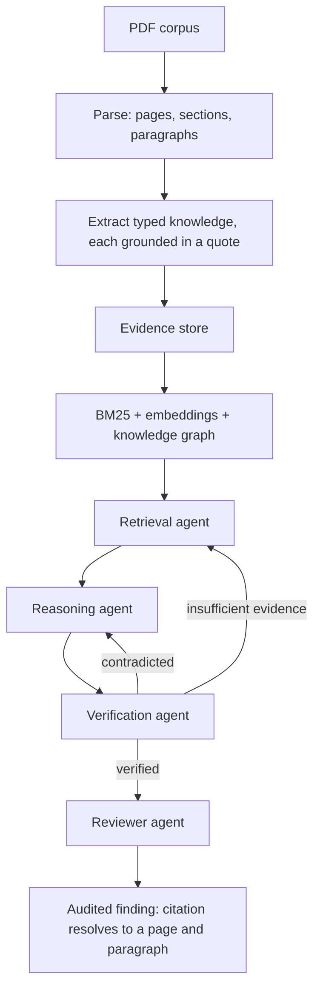

<h1 align="center">Aakash Jawle</h1>

  <b>Data &amp; AI engineer</b> — I build systems where every number can be traced back to where it came from.

  Final-year Computer Engineering @ PCCOE, Pune
  &nbsp;·&nbsp;
  Research Intern @ <b>TIH-IoT, IIT Bombay</b>

  
  
  

  
  
  
  

---

I build data and ML systems end to end — ingestion, storage, model, serving, evaluation — and I care most about the part that usually gets skipped: **proving the thing works**. Every project below ships with the measurement that would have exposed it if it didn't, including the numbers that don't flatter me.

Earlier this year I was at **TIH-IoT, IIT Bombay**, shipping crop-disease vision models into a production service under a ₹500 Crore IIT Bombay–Govt. of Maharashtra program reaching 2M+ farmers. Real constraints, real devices, real users.

> **Available for a full-time 6-month apprenticeship, Jan 2027 – Jul 2027.**

---

## 🛰️ OmniSignal — Explainable Equity Research Terminal

Most screeners score a company in isolation. OmniSignal scores it **against the macro cycle it's sitting in**.

Fifteen factors across five signal families are weighted by market regime, then passed through a probabilistic **macro-stress gate** computed live from FRED — yield curve inversion, CPI, Fed funds. What comes out is a single verdict where **every number is auditable**: each factor's contribution, every confidence deduction, and all nine risk components are shown, not summarized away. A language model narrates the finished scorecard; it never computes or alters a number.

The data layer is the part I'm proudest of. **13 upstream vendors sit behind 5 source-agnostic facades**, so nothing above them knows who served a price. Requests deduplicate in flight, fail over in health order, cross-validate numerically between two vendors, and fall back to stale cache as a last resort — a vendor outage **degrades** a response instead of failing it.

Validation is walk-forward on an expanding window with no look-ahead, graded against a 12-1 momentum baseline and buy &amp; hold: rank IC, hit rate, confidence calibration, Sharpe/Sortino/Calmar, and PSI drift — rendered live in the app for any ticker.

|  |  |
|---|---|
| Upstream vendors / provider facades | **13 → 5** |
| Factors / signal families | **15 in 5** |
| Persistence | Supabase Postgres, RLS on every table, CLI-managed migrations |
| Test suite | **215 pytest tests**, hermetic by default |

`Python` `FastAPI` `PostgreSQL (Supabase)` `Next.js 16` `Clerk` `Groq` `Docker` `Vercel + Render`

**[→ Live terminal](https://mini-aladding.vercel.app)** &nbsp;·&nbsp; **[→ Code](https://github.com/iAakash1/miniAladdin)**

---

## 🌿 PlantDx — Knowledge-grounded Vision–Language Diagnosis

A general open-weight VLM gets **7.3%** on tomato leaf disease. Fine-tuned on a corpus that no model ever touched, the same 7B model gets **93.7%**.

The usual shortcut is to distil captions *from* a large VLM — which bakes that model's mistakes into the student. PlantDx removes models from the caption path entirely: a curated, **cited** disease knowledge base is compiled deterministically into a typed ontology, a controlled vocabulary, per-disease concept models, and finally a validated instruction-tuning corpus. Every caption traces to a source, and the dataset rebuilds byte-for-byte from `(knowledge base, ontology, seed)`.

That corpus supervises **QLoRA fine-tuning of Qwen2.5-VL-7B** on Apple Silicon (MLX) — the 7B backbone frozen, 40.4M low-rank adapter params trained at rank 16.

| Crop | Classes | Images | Base acc. | Fine-tuned acc. | Macro-F1 |
|---|---:|---:|---:|---:|---:|
| 🍅 Tomato | 10 | 18,006 | 7.3% | **93.7%** | **0.919** |
| 🥭 Mango | 8 | 4,000 | 17.5% | **82.0%** | **0.811** |

  
  &nbsp;
  

  

Macro-averaged on purpose, so rare classes aren't masked by the common ones — and the weakest class (mango die back, F1 0.077) is reported rather than buried. These are in-distribution scores; casual phone photos score lower, and the demo says so with an explicit **low-confidence / unknown** state instead of a confident wrong answer.

`Python` `PyTorch` `Qwen2.5-VL-7B` `LoRA / PEFT` `MLX` `Streamlit` `mypy --strict`

**[→ Code](https://github.com/iAakash1/experimentation)**

---

## 🔍 ResearchAgent — Audited Multi-Agent Document Retrieval

Ask an LLM a research question and you get fluent prose with plausible citations. Some are real. Checking which ones is the actual work — and the system that produced them gives you no help with it.

ResearchAgent inverts that: the language model is an **untrusted component**. It proposes, and everything it proposes has to survive validators that can reject it. The guarantee is structural, not procedural — a `KnowledgeObject` **cannot be constructed** without evidence, a `ResearchFinding` **cannot be constructed** without a `Citation`, and a `Citation` **cannot be constructed** without an evidence-bundle id. A claim with no locatable evidence never becomes a finding at all; it's counted as a hypothesis and the rate is reported.

Five agents run under a checkpointed **LangGraph** state machine that routes on the verdict and budgets iterations, tool calls and tokens — an interrupted run resumes from its last checkpoint instead of restarting. Verification is adversarial by construction: provenance resolves *before* the model is asked anything, and the verifier is shown evidence the finding did **not** cite, because contradicting material is by definition what got left out.

Retrieval is measured on a 26-query gold set whose judgements were derived by reading the corpus — never generated by an LLM, because a benchmark labelled by a model measures agreement with that model:

| Arm | P@5 | R@10 | MRR | nDCG@5 |
|---|---:|---:|---:|---:|
| deterministic | 0.354 | 0.466 | 0.666 | 0.412 |
| bm25 | 0.308 | 0.548 | 0.648 | 0.377 |
| **semantic** | **0.600** | **0.738** | **0.910** | **0.698** |
| hybrid | 0.469 | 0.619 | 0.853 | 0.566 |

Honest reading: semantic wins clearly and **hybrid fusion dilutes it** — a weight ablation showed a monotone trend with pure-dense as the best endpoint. The production default is still `deterministic`, because all 26 gold queries are `draft` status and only reviewed judgements may back a claim. Nothing was tuned to make hybrid look better.

`Python 3.12` `LangGraph` `Pydantic v2` `FastAPI + SSE` `Qdrant` `Neo4j` `Ollama / Groq` `Docker` `660 tests in CI`

**[→ Code](https://github.com/iAakash1/researchAgent)**

---

## ⚡ MTCP — Multithreaded TCP Server (C++17 / POSIX)

No frameworks, no event-loop library, no abstractions — `socket()`, `bind()`, `listen()`, `accept()` and a fixed pthread pool behind a **bounded** task queue, so the server applies backpressure instead of OOM-ing under load and idle workers cost zero CPU.

The details are the point: `sendAll()` handles partial TCP writes, `MSG_NOSIGNAL` stops one dead client from killing the process, `SO_RCVTIMEO` keeps slow clients from starving the pool, and `pthread_cond_broadcast` drains in-flight work on graceful shutdown. Clean under Valgrind and ThreadSanitizer.

`C++17` `POSIX` `pthreads` `CMake`
&nbsp;&nbsp;**[→ Code](https://github.com/iAakash1/MTCP)**

---

## Experience

**Research Intern — TIH-IoT, IIT Bombay** &nbsp;·&nbsp; *Dec 2025 – May 2026*

- Benchmarked and shipped crop-disease vision models (MobileNetV2, ResNet in PyTorch/TensorFlow) into a production service for a **₹500 Crore** IIT Bombay–Govt. of Maharashtra program reaching **2M+ farmers**, holding **95%+ accuracy** on field-captured images.
- Traced accuracy loss to noisy real-world capture conditions, built a synthetic augmentation stage that widened training-data diversity by **40%**, then re-ran the benchmark to confirm the gain held instead of assuming it.
- Profiled the deployed model for resource-constrained edge IoT nodes and cut **inference latency by 30%**, keeping diagnostics usable offline on low-power field devices.

---

## Stack

  

**Languages** — Python · SQL · TypeScript · C++
**Data engineering** — batch &amp; async pipelines · ETL / ingestion · data modeling · indexing · schema migrations · data quality · Pandas · NumPy
**Databases** — PostgreSQL (Supabase) · MySQL · MongoDB · Qdrant
**Backend &amp; interfaces** — FastAPI · REST · SSE streaming · React · Next.js · pytest · Ruff / mypy
**AI &amp; ML** — PyTorch · Hugging Face · LangGraph · RAG &amp; retrieval · embeddings · fine-tuning (LoRA) · Groq &amp; Ollama
**Cloud &amp; DevOps** — Docker · AWS · Git · GitHub Actions CI/CD

---

## Education

**B.Tech, Computer Engineering** — Pimpri Chinchwad College of Engineering (PCCOE) &nbsp;·&nbsp; *Aug 2023 – May 2027*
CGPA **6.96 / 10** &nbsp;·&nbsp; Coursework: Database Management Systems, Data Structures &amp; Algorithms, Operating Systems, Software Engineering

---

## Beyond the code

- 🧑‍🏫 **ACM-W Coordinator, PCCOE** — taught hands-on technical workshops to **300+ students** and co-organized campus tech events.
- 🥈 **ML Wars Runner-Up** — built and iterated ML models under tight time constraints for a top-2 finish at PCCOE TechFest 2025.
- 🌍 **Open-source contributor** — merged a curriculum fix into **freeCodeCamp** (446k+ ⭐): [PR #66116](https://github.com/freeCodeCamp/freeCodeCamp/pull/66116). A second patch is open for review.
- 🧩 **300+ DSA problems** across platforms — [LeetCode](https://leetcode.com/u/jawleaakash/) · [Codeforces](https://codeforces.com/profile/Aakash13) (Newbie, 1088) · [HackerRank](https://www.hackerrank.com/profile/aakashjawle101) 5★ · [CodeChef](https://www.codechef.com/users/aakashj13) 2★
- 📜 Certifications — CodeHelp (DSA, Web Dev) · Coding Ninjas (Python)

---

<picture>
  <source media="(prefers-color-scheme: dark)" srcset="https://github-profile-summary-cards.vercel.app/api/cards/most-commit-language?username=iAakash1&theme=github_dark"/>
  
</picture>
&nbsp;&nbsp;
<picture>
  <source media="(prefers-color-scheme: dark)" srcset="https://github-profile-summary-cards.vercel.app/api/cards/repos-per-language?username=iAakash1&theme=github_dark"/>
  
</picture>

  

<picture>
  <source media="(prefers-color-scheme: dark)" srcset="https://raw.githubusercontent.com/iAakash1/iAakash1/output/snake-dark.svg"/>
  <source media="(prefers-color-scheme: light)" srcset="https://raw.githubusercontent.com/iAakash1/iAakash1/output/snake.svg"/>
  
</picture>

 

<b>Building something that needs a data pipeline you can actually trust? <a href="mailto:aakashjawle101@gmail.com">Let's talk.</a></b>

